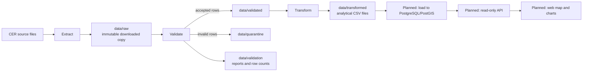
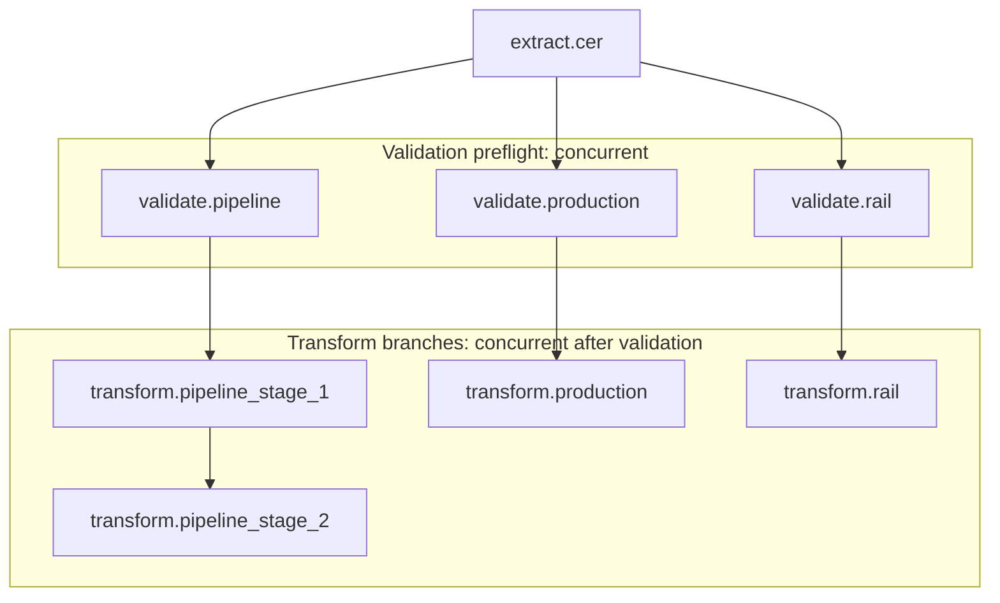
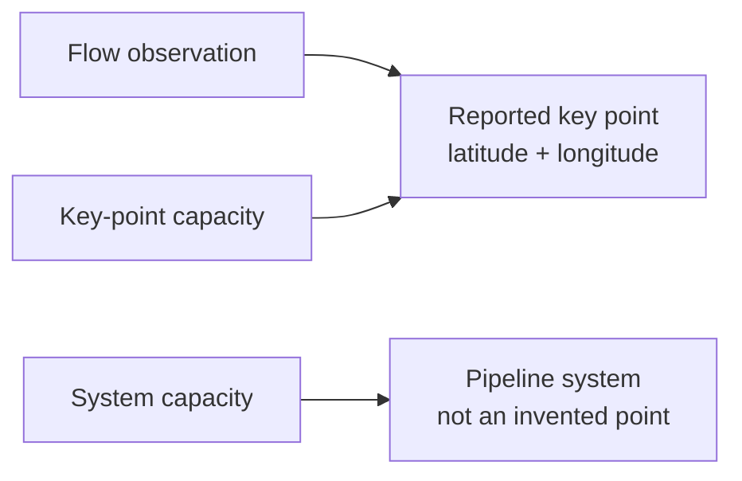

# Alberta Oil Data Pipeline

This project retrieves selected Canada Energy Regulator (CER) oil data,
validates it without overwriting the source record, transforms it into
analysis-ready tables, and is being prepared for loading into PostGIS and
publishing on a web map.

The project currently covers:

- CER pipeline throughput for Enbridge Mainline, Keystone, and Trans Mountain;
- CER estimated production for Alberta and Saskatchewan;
- CER monthly crude-oil exports by rail.

The central rule is to preserve what CER reports while making the analytical
meaning clear. In particular, flow observations belong to reported key points,
whereas capacity can be key-point scoped or system scoped. A system-capacity
value must not be displayed as though it were measured at an arbitrary point.

## What the pipeline does



Validation does not alter the raw download. It writes accepted records for the
transforms and keeps rejected records and reports so a refresh remains
auditable.

## Repository layout

```text
.
├── requirements.txt                 Python dependencies
├── README.md                        This guide
├── docs/journal-codex/              Design and implementation handoffs
└── project/
    ├── pipeline/
    │   ├── extract/                 CER retrieval code
    │   ├── validate/                Data contracts and validators
    │   ├── transform/               Analytical transformations
    │   ├── load/                    Reserved for database loaders
    │   ├── config/                  Paths and source definitions
    │   ├── utils/                   Run lineage, downloads, metadata helpers
    │   └── orchestrator.py          CLI task DAG
    ├── data/
    │   ├── raw/                     Downloaded source files and retrieval log
    │   ├── validated/               Accepted validator outputs
    │   ├── quarantine/              Rejected rows
    │   ├── validation/              Validation reports and row history
    │   └── transformed/             Tables ready for loading
    ├── tests/                       Unit tests
    └── docker-compose.yml           Database starting point; not yet production-ready
```

Run commands from `project/`, because it is the Python import root. The virtual
environment currently lives at the repository root.

## Setup

From the repository root in PowerShell:

```powershell
.\.venv\Scripts\Activate.ps1
pip install -r requirements.txt
cd project
```

If the virtual environment has not been created yet:

```powershell
python -m venv .venv
.\.venv\Scripts\Activate.ps1
pip install -r requirements.txt
cd project
```

The current dependencies support extraction, Excel reading, and Polars-based
data work. A PostgreSQL driver will be added when the load layer begins.

## Running the pipeline

The orchestrator is the normal entry point:

```powershell
python -m pipeline.orchestrator full
```

Use a dry run to see exactly what would execute without retrieving or changing
data:

```powershell
python -m pipeline.orchestrator full --dry-run
```

For a scheduler, record the run as scheduled rather than a manual refresh:

```powershell
python -m pipeline.orchestrator full --run-type scheduled
```

List stages, tasks, descriptions, and dependencies:

```powershell
python -m pipeline.orchestrator list
```

Run one task, including its dependencies by default:

```powershell
python -m pipeline.orchestrator task transform.rail
```

`--no-deps` is only for intentional reruns where the required upstream files
already exist. For example, it can rerun a transform from existing validated
data, but it skips the normal safety checks.

## Current execution plan

A normal `full` dry run resolves to:

```text
1. extract.cer
2. validate.pipeline
3. validate.production
4. validate.rail
5. transform.pipeline_stage_1
6. transform.pipeline_stage_2
7. transform.production
8. transform.rail
```

The resolved order is dependency-safe. Runtime execution uses a hybrid model:



All three validators must finish successfully before any transform begins.
Once that barrier passes, the pipeline branch runs stage 1 then stage 2, while
production and rail run alongside it. Each task emits `Starting:` and
`Completed:` status messages.

## Naming conventions

There are two deliberate naming patterns:

| Where | Pattern | Examples | Why |
| --- | --- | --- | --- |
| Validator filenames | source letter + stage number | `a_0_pipeline_validation.py`, `b_0_production_validation.py` | Makes source grouping and file order visible on disk. |
| Orchestrator tasks | layer + source name | `validate.pipeline`, `transform.production`, `transform.rail` | Gives the CLI and execution plan one consistent, readable vocabulary. |
| Pipeline transforms | source letter + stage number in filename, descriptive task name | `a_1_pipeline_transform.py`, `transform.pipeline_stage_1` | Preserves the ordered pipeline chain without making CLI task names cryptic. |

Letters identify independent source branches; numbers identify dependencies
within a branch. For example, `a_1` must complete before `a_2`. The validator
file stages are retained, but their task names remain source-based.

## Source data and outputs

| Source | Validated input | Transformed output | Grain |
| --- | --- | --- | --- |
| Enbridge, Keystone, Trans Mountain | individual accepted throughput CSVs | `pipeline_flow.csv`, `pipeline_capacity.csv` | Monthly source observation |
| CER estimated production workbook | `cer_production_validated.csv` | `western_canada_estimated_production.csv` | Month and oil type |
| CER rail workbook | `cer_rail_validated.csv` | `monthly_rail_exports.csv` | Month |

`data/transformed/source_metadata.csv` records workbook report metadata and
links it to retrieval lineage when available.

### Pipeline flow versus capacity



`pipeline_flow.csv` includes key-point coordinates and can support a point
map. `pipeline_capacity.csv` includes `capacity_scope`:

- `key_point`: the reported capacity basis is a key point.
- `system`: the reported capacity applies to the pipeline system. Trans
  Mountain is the important case: total flow is summed from non-system key
  points, but capacity remains system scoped.

Keep that distinction in analytical queries, database design, API responses,
and map tooltips.

## Validation behavior and lineage

Validators apply source contracts, write accepted outputs, quarantine invalid
records, and record reports. Warnings allow the pipeline to continue; fatal
validation stops downstream transformation.

- Pipeline throughput validates permitted domains and duplicate normalized keys.
- Production validates observed fields, monthly uniqueness, non-negative finite
  metrics, and the Canada-total reconciliation condition.
- Rail validates month/year uniqueness, non-negative finite volumes, and its
  report date.
- If a rail workbook's update date cannot be parsed, the pipeline warns and
  assumes the final calendar day of its newest data month. The metadata label is
  stored as `ASSUMED:` so the fallback is visible.

`data/raw/retrieval_log.csv` is the ingestion ledger. New retrievals include a
run UUID and either `forced` or `scheduled` run type. Never rewrite historical
ledger rows to invent missing lineage.

## Testing

From the repository root:

```powershell
.\.venv\Scripts\python -m compileall -q project\pipeline project\tests
Push-Location project
..\.venv\Scripts\python -m unittest discover -s tests -v
Pop-Location
```

The suite currently has 26 tests covering source validators, rail fallback
logic, production workbook selection and reconciliation warnings, retrieval
lineage, and orchestrator DAG planning.

Useful operational checks after a refresh:

```powershell
python -m pipeline.orchestrator full --dry-run
python -m pipeline.orchestrator validate
```

Inspect warnings, `data/quarantine/`, and `data/validation/` before treating a
new transformed dataset as publishable.

## Database and map roadmap

The repository does not yet have a working database loader. The planned path
is:

1. Repair `project/docker-compose.yml`, use PostgreSQL with PostGIS, add a
   health check, and create a Flyway migration directory and baseline schema.
2. Define database tables for pipelines, locations, monthly flow, monthly
   capacity, production, rail, lineage, and route geometry.
3. Implement idempotent loaders as `load.pipeline`, `load.production`, and
   `load.rail`; test them against a temporary PostGIS database.
4. Add those loads to `full` after transform, retaining the validation barrier.
5. Acquire authoritative, redistributable pipeline route geometry and preserve
   its licence, attribution, and provenance in a separate route table.
6. Build a read-only API for routes, monthly flow, capacity, charts, and data
   freshness.
7. Build a MapLibre GL JS site with filters, a month selector, tooltips,
   attribution, and an accessible non-map alternative.

Do not infer official pipeline routes by connecting reported key-point
coordinates unless the result is explicitly labelled as schematic. Do not show
system capacity as a point measurement.

For fuller implementation history and detailed next steps, see:

- [Validation and lineage journal](docs/journal-codex/2026-09-14-validation-and-lineage-journal.md)
- [Transformation changes](docs/journal-codex/2026-09-15-alberta_oil_codex_changes.md)
- [Completed validation implementation brief](docs/journal-codex/2026-09-16-alberta_oil_next_steps_implementation_brief.md)
- [Load and map next steps](docs/journal-codex/2026-09-16-alberta_oil_load_and_map_next_steps.md)

## Before publishing

Before any public deployment, confirm:

- route geometry has a compatible licence and required attribution;
- source refresh dates are shown to users;
- map labels distinguish reported observation points from inferred or route
  geometry;
- the database has backups, migrations, and repeatable deployment steps;
- scheduled refreshes keep the last successful published dataset if a new run
  fails;
- the site has a clear methodology page and an accessible alternative to the
  interactive map.
